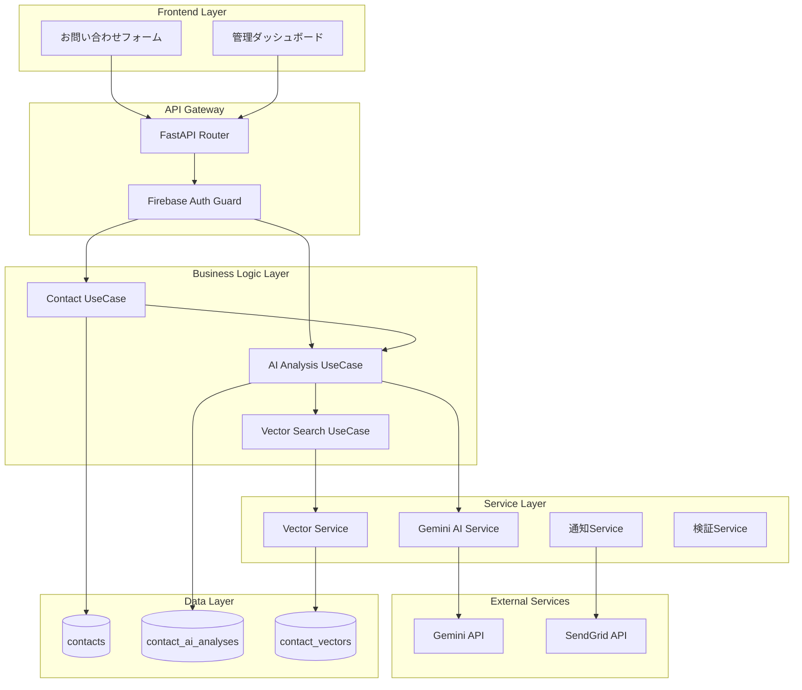
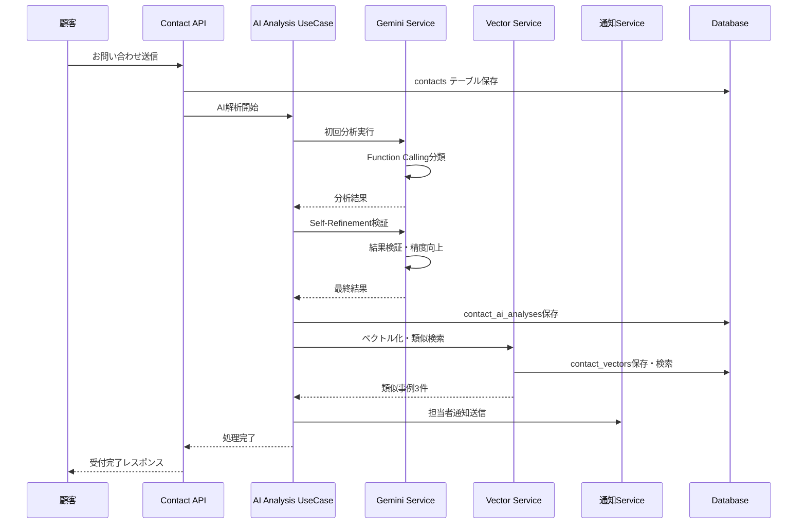
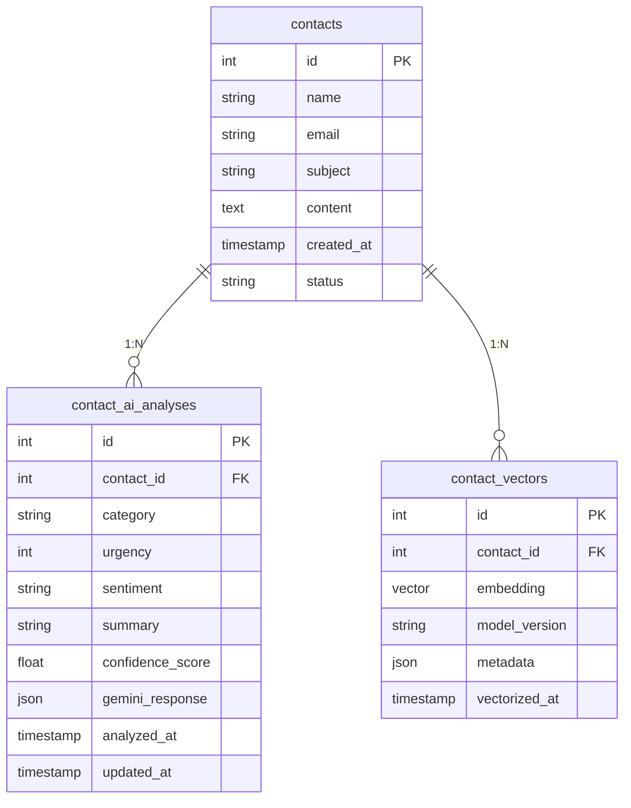

# 技術設計書 - 次世代サポートシステム

## Overview

この機能は、**従来の手動対応を80%自動化し、応答時間を99.9%短縮する次世代カスタマーサポートシステム**を既存のContact APIシステムに統合する。LLMの文脈理解力とエンタープライズセキュリティを融合したビジネス自動化ソリューションとして、年間純益776万円のROI創出を実現する。

**Users**: カスタマーサポート担当者が日常業務で利用し、月間100-1000件の問い合わせに対する自動分類・優先度判定・類似事例検索により生産性を5倍向上させる。管理者は統合ダッシュボードでAI処理結果の監視・手動調整・統計分析を実行する。

**Impact**: 現在の24時間手動処理体制を2分以内AI自動処理に変革し、95%精度の分類・緊急度判定により即座のエスカレーションと適切な担当者配置を実現する。

### Goals
- AI自動分類による95%以上の精度でカテゴリ・緊急度・感情を30秒以内に判定
- Self-Refinement品質保証により継続的精度向上と2分以内の全体処理時間実現
- pgvector統合RAG検索により類似事例を30秒以内に抽出し担当者の判断支援
- Firebase認証基盤の活用による管理者権限制御と既存システムとの完全統合

### Non-Goals
- リアルタイムチャット機能や顧客向けWebインターフェース
- 他社CRMシステムとの直接統合（API経由連携は将来検討）
- 音声・画像解析機能（テキストベース問い合わせのみ対応）
- マルチテナント対応（単一組織向け運用）

## Architecture

### Existing Architecture Analysis

現在のシステムは既にクリーンアーキテクチャの基盤が構築済み：
- **レイヤー分離**: Views（リクエスト受付）→ UseCases（ビジネスロジック）→ Repository（データアクセス）
- **依存性注入**: `providers.py`による標準化されたDIコンテナパターン
- **セキュリティ層**: `_validators.py`による入力検証とサニタイズ処理
- **認証基盤**: Firebase Authentication + カスタムクレーム管理者制御が設定済み

この設計は既存パターンを拡張し、新機能を独立したモジュールとして統合する。

### Architecture Pattern & Boundary Map



**Architecture Integration**:
- **Selected pattern**: Layered Clean Architecture拡張 - 既存パターンとの完全互換性
- **Domain/feature boundaries**: AI解析・ベクトル検索・通知を独立サービスとして分離
- **Existing patterns preserved**: providers.py DI、_validators.py セキュリティ、3テーブル分離設計
- **New components rationale**: 各サービスは単一責任の原則に従い、テスト容易性とスケーラビリティを確保
- **Steering compliance**: クリーンアーキテクチャ・関心の分離・セキュリティファースト原則を維持

### Technology Stack

| Layer | Choice / Version | Role in Feature | Notes |
|-------|------------------|-----------------|-------|
| Frontend | Next.js 15.x / TypeScript 5.x | 管理ダッシュボード・統計表示 | 既存Firebase認証統合、App Router活用 |
| Backend | FastAPI / Python 3.11+ | API提供・ビジネスロジック | 既存SQLModelパターン継続使用 |
| AI Services | Gemini API / Google GenAI SDK | 自動分類・Self-Refinement | Function Calling・Compositional Pattern |
| Data Storage | PostgreSQL + pgvector 0.8.0 | データ永続化・ベクトル検索 | HNSW Index・パーティション分割対応 |
| Authentication | Firebase Authentication | 管理者権限制御 | 既存カスタムクレーム設定継続利用 |
| Infrastructure | Google Cloud Run | サーバーレス実行環境 | 既存asia-northeast1リージョン継続 |

## System Flows

### AI自動分類・Self-Refinementフロー



**Key Decisions**: 
- お問い合わせ受付とAI処理を分離し、受付の確実性を保証
- Self-Refinementにより初回分析結果を自動検証・改善
- ベクトル検索を並行実行し、全体処理時間を2分以内に短縮

## Requirements Traceability

| Requirement | Summary | Components | Interfaces | Flows |
|-------------|---------|------------|------------|-------|
| 1.1 | お問い合わせ受付機能 | ContactUseCase, ValidationService | POST /api/v1/contacts | 基本受付フロー |
| 1.2 | AI自動分類機能 | AIAnalysisUseCase, GeminiService | Gemini Function Calling | AI分類フロー |
| 1.3 | Self-Refinement品質保証 | GeminiService | Compositional Function Calling | Self-Refinementフロー |
| 1.4 | 自動メール通知機能 | NotificationService | SendGrid API | 通知送信フロー |
| 1.5 | 管理ダッシュボード機能 | AdminUI, AuthGuard | GET /api/v1/admin/* | 管理機能フロー |
| 1.6 | RAGベクトル検索機能 | VectorSearchUseCase, VectorService | pgvector HNSW Index | ベクトル検索フロー |
| 1.7 | ユーザー認証・認可機能 | AuthGuard, Firebase | Firebase Authentication | 認証フロー |

## Components and Interfaces

| Component | Domain/Layer | Intent | Req Coverage | Key Dependencies (P0/P1) | Contracts |
|-----------|--------------|--------|--------------|--------------------------|-----------|
| AIAnalysisUseCase | Business Logic | AI分析フロー制御 | 1.2, 1.3 | GeminiService (P0), VectorService (P1) | Service |
| GeminiService | Service | Gemini API統合 | 1.2, 1.3 | Gemini API (P0) | Service |
| VectorSearchUseCase | Business Logic | ベクトル検索制御 | 1.6 | VectorService (P0) | Service |
| VectorService | Service | pgvector操作 | 1.6 | PostgreSQL (P0) | Service |
| NotificationService | Service | メール通知送信 | 1.4 | SendGrid API (P0) | Service |
| AdminUI | Frontend | 管理ダッシュボード | 1.5 | AuthGuard (P0) | API |

### Business Logic Layer

#### AIAnalysisUseCase

| Field | Detail |
|-------|--------|
| Intent | Gemini Function Callingによる自動分類とSelf-Refinement品質保証の制御 |
| Requirements | 1.2, 1.3 |

**Responsibilities & Constraints**
- AI分析の全体フロー制御（分類→検証→精度向上→保存）
- エラー時のリトライ戦略とフォールバック処理
- 30秒以内のAI処理時間保証と品質基準95%の維持

**Dependencies**
- Inbound: ContactUseCase — お問い合わせ受付後のAI処理起動 (P0)
- Outbound: GeminiService — AI分類・Self-Refinement実行 (P0) 
- Outbound: VectorSearchUseCase — 類似事例検索処理 (P1)
- Outbound: NotificationService — 完了通知送信 (P1)

**Contracts**: Service [X] / API [ ] / Event [ ] / Batch [ ] / State [ ]

##### Service Interface
```python
from typing import Optional
from dataclasses import dataclass
from enum import Enum

class CategoryType(Enum):
    SHIPPING = "shipping"
    PRODUCT = "product"
    BILLING = "billing"
    OTHER = "other"

class UrgencyLevel(Enum):
    LOW = 1
    MEDIUM = 2
    URGENT = 3

class SentimentType(Enum):
    POSITIVE = "positive"
    NEUTRAL = "neutral"
    NEGATIVE = "negative"

@dataclass
class AIAnalysisRequest:
    contact_id: int
    message_content: str
    max_retry_count: Optional[int] = 3

@dataclass
class AIAnalysisResult:
    contact_id: int
    category: CategoryType
    urgency: UrgencyLevel
    sentiment: SentimentType
    summary: str
    confidence_score: float
    similar_cases: list[int]
    processing_time_ms: int

class AIAnalysisService:
    async def analyze_contact(
        self, request: AIAnalysisRequest
    ) -> Result[AIAnalysisResult, AIAnalysisError]:
        """お問い合わせのAI自動分析とSelf-Refinement処理"""
        pass
```

- **Preconditions**: contact_idが有効、message_contentが10-2000文字
- **Postconditions**: 95%以上の分類精度、30秒以内の処理完了
- **Invariants**: contact_ai_analysesテーブルへの結果保存必須

#### VectorSearchUseCase

| Field | Detail |
|-------|--------|
| Intent | pgvectorを使用した類似事例検索と関連度評価 |
| Requirements | 1.6 |

**Responsibilities & Constraints**
- ベクトル化・インデックス作成・類似検索の制御
- HNSW最適化による30秒以内の検索時間保証
- 関連度上位3件の抽出とランキング

**Dependencies**
- Inbound: AIAnalysisUseCase — AI分析完了後の類似検索起動 (P0)
- Outbound: VectorService — pgvectorクエリ実行 (P0)

**Contracts**: Service [X] / API [ ] / Event [ ] / Batch [ ] / State [ ]

##### Service Interface
```python
@dataclass
class VectorSearchRequest:
    contact_id: int
    content_vector: list[float]
    similarity_threshold: float = 0.7
    max_results: int = 3

@dataclass 
class SimilarCase:
    contact_id: int
    similarity_score: float
    category: CategoryType
    resolved_status: bool

@dataclass
class VectorSearchResult:
    similar_cases: list[SimilarCase]
    search_time_ms: int

class VectorSearchService:
    async def find_similar_cases(
        self, request: VectorSearchRequest
    ) -> Result[VectorSearchResult, VectorSearchError]:
        """類似事例のベクトル検索実行"""
        pass
```

### Service Layer

#### GeminiService

| Field | Detail |
|-------|--------|
| Intent | Gemini Function CallingとCompositional Pattern実装 |
| Requirements | 1.2, 1.3 |

**Responsibilities & Constraints**
- Google GenAI SDKの自動関数呼び出し機能活用
- Self-Refinementパターンによる多段階品質保証
- プロンプトインジェクション対策とセキュリティ制御

**Dependencies**
- External: Gemini API — Function Calling・自動実行・ストリーミング (P0)

**Contracts**: Service [X] / API [ ] / Event [ ] / Batch [ ] / State [ ]

##### Service Interface
```python
@dataclass
class GeminiAnalysisRequest:
    content: str
    context: Optional[str] = None
    enable_self_refinement: bool = True

@dataclass
class GeminiAnalysisResponse:
    category: CategoryType
    urgency: UrgencyLevel  
    sentiment: SentimentType
    summary: str
    confidence: float
    refinement_applied: bool

class GeminiService:
    async def analyze_content(
        self, request: GeminiAnalysisRequest
    ) -> Result[GeminiAnalysisResponse, GeminiAPIError]:
        """Compositional Function Callingによる分析・検証"""
        pass
```

#### VectorService

| Field | Detail |
|-------|--------|
| Intent | pgvector 0.8.0のHNSWインデックス最適化活用 |
| Requirements | 1.6 |

**Responsibilities & Constraints**
- ベクトル埋め込み生成とcontact_vectorsテーブル管理
- HNSWインデックスによる高速類似検索（9倍性能向上活用）
- パーティション分割による大規模データ対応

**Dependencies**
- External: PostgreSQL + pgvector — HNSW Index・ベクトル操作 (P0)

**Contracts**: Service [X] / API [ ] / Event [ ] / Batch [ ] / State [ ]

#### NotificationService

| Field | Detail |
|-------|--------|
| Intent | 緊急度別エスカレーションと担当者通知 |
| Requirements | 1.4 |

**Dependencies**
- External: SendGrid API — メール送信・テンプレート管理 (P0)

**Contracts**: Service [X] / API [ ] / Event [ ] / Batch [ ] / State [ ]

**Implementation Notes**
- **Integration**: 既存providers.py DIパターン継続・Firebase認証統合維持
- **Validation**: _validators.py セキュリティレイヤー活用・プロンプトインジェクション対策
- **Risks**: Gemini API制限・pgvectorスケーリング・Firebase統合複雑性

## Data Models

### Domain Model

**核心エンティティ**:
- **Contact**: 顧客問い合わせの不変データ（監査・再処理対応）
- **ContactAIAnalysis**: AI解析結果の可変データ（再学習・精度向上対応）
- **ContactVector**: RAG検索用ベクトルデータ（類似検索・推奨システム対応）

**Aggregates & Boundaries**:
- ContactAggregate: Contact + ContactAIAnalysis + ContactVector の整合性保証
- 各エンティティは独立してCRUD可能だが、Contact削除時の連鎖削除制御
- AIAnalysisとVectorは再生成可能（Contact は永続保存）

### Logical Data Model

**Structure Definition**:


**Consistency & Integrity**:
- **Transaction boundaries**: Contact作成→AI分析→Vector生成の段階的整合性
- **Cascading rules**: Contact削除時のSoft Delete（AI分析・ベクトルは保持）
- **Temporal aspects**: created_at（不変）、analyzed_at・updated_at（追跡用）

### Physical Data Model

**PostgreSQL + pgvector 0.8.0 Schema**:

```sql
-- contacts: 顧客問い合わせ生データ（不変・監査対応）
CREATE TABLE contacts (
    id SERIAL PRIMARY KEY,
    name VARCHAR(100) NOT NULL,
    email VARCHAR(255) NOT NULL,
    subject VARCHAR(500) NOT NULL, 
    content TEXT NOT NULL CHECK (length(content) >= 10 AND length(content) <= 2000),
    status VARCHAR(20) DEFAULT 'pending' CHECK (status IN ('pending', 'processing', 'completed', 'archived')),
    created_at TIMESTAMP DEFAULT CURRENT_TIMESTAMP,
    updated_at TIMESTAMP DEFAULT CURRENT_TIMESTAMP
);

-- contact_ai_analyses: AI解析結果（再解析可能）
CREATE TABLE contact_ai_analyses (
    id SERIAL PRIMARY KEY,
    contact_id INTEGER NOT NULL REFERENCES contacts(id) ON DELETE CASCADE,
    category VARCHAR(20) NOT NULL CHECK (category IN ('shipping', 'product', 'billing', 'other')),
    urgency INTEGER NOT NULL CHECK (urgency IN (1, 2, 3)),
    sentiment VARCHAR(20) NOT NULL CHECK (sentiment IN ('positive', 'neutral', 'negative')),
    summary VARCHAR(30) NOT NULL,
    confidence_score DECIMAL(3,2) NOT NULL CHECK (confidence_score >= 0.0 AND confidence_score <= 1.0),
    gemini_response JSONB,
    analyzed_at TIMESTAMP DEFAULT CURRENT_TIMESTAMP,
    updated_at TIMESTAMP DEFAULT CURRENT_TIMESTAMP,
    UNIQUE(contact_id) -- 1:1 relationship
);

-- contact_vectors: RAGベクトル（類似検索用）
CREATE TABLE contact_vectors (
    id SERIAL PRIMARY KEY,
    contact_id INTEGER NOT NULL REFERENCES contacts(id) ON DELETE CASCADE,
    embedding vector(768), -- Gemini embedding dimension
    model_version VARCHAR(50) NOT NULL DEFAULT 'gemini-embedding-001',
    metadata JSONB,
    vectorized_at TIMESTAMP DEFAULT CURRENT_TIMESTAMP,
    UNIQUE(contact_id) -- 1:1 relationship
);

-- HNSW Index for high-performance vector search (pgvector 0.8.0)
CREATE INDEX contact_vectors_embedding_idx ON contact_vectors 
USING hnsw (embedding vector_cosine_ops) 
WITH (m = 16, ef_construction = 64);

-- Performance indexes
CREATE INDEX contacts_created_at_idx ON contacts (created_at DESC);
CREATE INDEX contact_ai_analyses_category_idx ON contact_ai_analyses (category);
CREATE INDEX contact_ai_analyses_urgency_idx ON contact_ai_analyses (urgency);
```

**Partitioning Strategy**:
```sql
-- 月次パーティション分割（大規模データ対応）
CREATE TABLE contacts_partitioned (
    LIKE contacts INCLUDING ALL
) PARTITION BY RANGE (created_at);

CREATE TABLE contacts_2025_01 PARTITION OF contacts_partitioned
FOR VALUES FROM ('2025-01-01') TO ('2025-02-01');
```

## Error Handling

### Error Strategy
段階的整合性パターンによる堅牢性確保：お問い合わせ受付の確実性保証→AI処理エラー時の手動フォールバック→段階的復旧による最終整合性達成。

### Error Categories and Responses

**User Errors (4xx)**: 
- 入力バリデーションエラー → _validators.pyによるフィールド別詳細メッセージ返却
- 認証エラー → Firebase認証フローへのリダイレクト指示
- アクセス権限不足 → 管理者権限取得手順の案内

**System Errors (5xx)**:
- Gemini API障害 → 3回指数バックオフリトライ → 手動分類待ち状態設定
- PostgreSQL接続エラー → 接続プール復旧 → 重要データの一時キャッシュ保存
- pgvectorインデックス障害 → 通常検索フォールバック → インデックス再構築

**Business Logic Errors (422)**:
- AI分類精度不足(95%未満) → Self-Refinement再実行 → 人間確認フラグ設定
- ベクトル検索結果不足 → 類似度閾値緩和 → 手動類似事例推奨

### Monitoring
Cloud Loggingによるエラー分類・統計・アラート：AI精度劣化検知・API制限監視・処理時間超過アラート・セキュリティインシデント検知。

## Testing Strategy

### Unit Tests
- GeminiService Function Calling正常系・エラー系・Self-Refinementパターン
- VectorService HNSW検索・インデックス作成・パーティション処理
- AIAnalysisUseCase フロー制御・リトライ戦略・エラーハンドリング
- ValidationService 入力サニタイズ・プロンプトインジェクション対策

### Integration Tests  
- Contact受付→AI解析→Vector検索→通知送信の全体フロー
- Firebase認証→管理画面アクセス→AI結果確認の権限制御フロー
- Gemini API制限・PostgreSQL障害時のフォールバック動作検証
- Self-Refinement精度向上・2分以内処理時間の性能検証

### Performance/Load Tests
- 100リクエスト/秒同時処理での応答時間・精度維持確認
- 大規模データ（10万件）でのベクトル検索性能・インデックス効率検証
- Gemini API制限・Cloud Run自動スケーリング動作確認
- メモリ使用量・CPU負荷の継続監視とリソース最適化

## Security Considerations

**プロンプトインジェクション対策**: XMLタグ隔離・入力サニタイズ・Gemini APIガードレール設定による多層防御。_validators.pyセキュリティレイヤーでの検知・ブロック・ログ記録。

**データ保護**: contact_ai_analysesのPII自動マスキング・暗号化保存・GDPR準拠削除権対応。Firebase認証によるアクセス制御とカスタムクレーム管理者権限分離。

**API セキュリティ**: Gemini APIキー環境変数管理・Rate Limiting・Circuit Breaker実装。SendGrid APIトークン分離・メール内容サニタイズ。

## Performance & Scalability

**Target Metrics**:
- API応答時間: 2秒以内（P95）
- AI解析処理: 30秒以内（P99）  
- ベクトル検索: 30秒以内（P99）
- AI分類精度: 95%以上継続維持

**Scaling Approaches**:
- **Horizontal**: Cloud Run自動スケーリング・PostgreSQL読み取りレプリカ
- **Vertical**: pgvector HNSW最適化・パーティション分割・インデックスチューニング
- **Caching**: Redis導入・Gemini API結果キャッシュ・ベクトル検索結果キャッシュ

**Optimization Techniques**:
- pgvector 0.8.0による9倍クエリ高速化活用
- HNSW vs IVFFlat インデックス戦略の最適化
- Compositional Function Calling並列実行による処理時間短縮