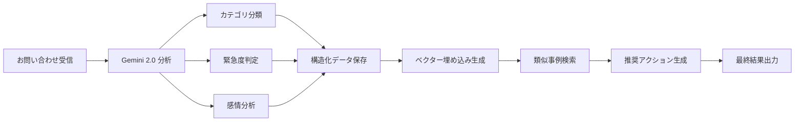

# Contact API エンドポイント仕様書

## 概要

Contact APIは次世代カスタマーサポートシステムのためのRESTful APIです。AI分析、ベクター検索、リアルタイム通知機能を備えています。

**Base URL**: `http://localhost:8000` (開発環境)  
**API Version**: v1  
**認証**: 現在はデモ環境のため認証なし

## システム情報エンドポイント

### GET `/` - システムステータス取得
システム全体の状態と設定情報を取得します。

**Response**:
```json
{
  "service_name": "Contact API",
  "version": "1.0.0",
  "status": "healthy",
  "environment": "development",
  "timestamp": "2026-03-06T11:35:52.443299",
  "features": [
    "お問い合わせ管理",
    "AI分析", 
    "ベクター検索",
    "レスポンシブUI"
  ],
  "firebase_status": {
    "available": false,
    "initialized": false
  },
  "database_status": {
    "available": true,
    "initialized": true,
    "connected": true
  },
  "ai_status": {
    "available": true,
    "initialized": true,
    "model": "demo-model"
  },
  "vector_status": {
    "available": true,
    "initialized": true,
    "model": "text-search"
  },
  "email_status": {
    "available": false,
    "initialized": false,
    "service": "none"
  }
}
```

### GET `/health` - ヘルスチェック
サービスの健全性チェックを行います。

**Response**:
```json
{
  "status": "healthy",
  "service": "Contact API",
  "database": "connected",
  "ai_service": "available",
  "vector_search": "ready",
  "email_service": "operational",
  "auth_mode": "demo",
  "storage_mode": "memory",
  "ai_mode": "demo",
  "vector_mode": "simple-search",
  "email_mode": "disabled",
  "port": 8000,
  "features_enabled": {
    "crud_operations": true,
    "firebase_auth": false,
    "database": true,
    "ai_analysis": true,
    "vector_search": true,
    "email_notifications": false
  }
}
```

## お問い合わせ管理エンドポイント

### POST `/api/v1/contacts` - お問い合わせ作成

新しいお問い合わせを作成し、自動的にAI分析を実行します。

**Request Body**:
```json
{
  "name": "山田太郎",
  "email": "yamada@example.com",
  "subject": "ログイン問題について", 
  "message": "ログインができない状況です。パスワードリセットを試しましたが改善されません。"
}
```

**Response**:
```json
{
  "id": "60778b59-7036-4c86-b7e8-fd9a24bfe7ac",
  "name": "山田太郎",
  "email": "yamada@example.com", 
  "subject": "ログイン問題について",
  "message": "ログインができない状況です。パスワードリセットを試しましたが改善されません。",
  "status": "pending",
  "created_at": "2026-03-06T11:20:56.300884",
  "user_authenticated": false,
  "ai_analysis": {
    "category": "general",
    "urgency": "medium", 
    "sentiment": "neutral",
    "confidence_score": 0.8,
    "key_topics": ["問い合わせ"],
    "recommended_action": "24時間以内に初回回答をお送りください",
    "model_used": "demo-model",
    "analyzed_at": "2026-03-06T11:20:56.300925"
  },
  "similar_contacts": [],
  "notifications_sent": []
}
```

**Status Codes**:
- `200 OK`: 正常に作成完了
- `422 Unprocessable Entity`: 入力データが無効

### GET `/api/v1/contacts` - お問い合わせ一覧取得

すべてのお問い合わせの一覧を取得します。

**Response**:
```json
{
  "contacts": [
    {
      "id": "contact-uuid",
      "name": "お客様名",
      "email": "customer@example.com",
      "subject": "件名",
      "message": "お問い合わせ内容",
      "status": "pending",
      "created_at": "2026-03-06T11:20:56.300884",
      "user_authenticated": false,
      "ai_analysis": { /* AI分析結果 */ },
      "similar_contacts": [],
      "notifications_sent": []
    }
  ],
  "total": 5,
  "page": 1,
  "page_size": 5
}
```

**Status Codes**:
- `200 OK`: 正常に取得完了

### GET `/api/v1/contacts/{contact_id}` - お問い合わせ詳細取得

指定されたIDのお問い合わせ詳細を取得します。

**Path Parameters**:
- `contact_id` (string): お問い合わせID（UUID）

**Response**:
```json
{
  "id": "60778b59-7036-4c86-b7e8-fd9a24bfe7ac",
  "name": "山田太郎",
  "email": "yamada@example.com",
  "subject": "ログイン問題について", 
  "message": "ログインができない状況です。",
  "status": "pending",
  "created_at": "2026-03-06T11:20:56.300884",
  "user_authenticated": false,
  "ai_analysis": { /* AI分析結果詳細 */ },
  "similar_contacts": [ /* 類似お問い合わせリスト */ ],
  "notifications_sent": [ /* 送信済み通知リスト */ ]
}
```

**Status Codes**:
- `200 OK`: 正常に取得完了
- `404 Not Found`: 指定されたIDのお問い合わせが見つからない

## ベクター検索エンドポイント

### POST `/api/v1/search` - 類似お問い合わせ検索

キーワードベースで類似するお問い合わせを検索します。

**Request Body**:
```json
{
  "query": "ログイン",
  "limit": 5
}
```

**Parameters**:
- `query` (string, required): 検索キーワード
- `limit` (integer, optional): 結果の最大件数（デフォルト: 5）

**Response**:
```json
[
  {
    "contact_id": "60778b59-7036-4c86-b7e8-fd9a24bfe7ac",
    "subject": "ログイン問題について",
    "message": "ログインができない状況です。パスワードリセットを試しましたが改善されません。",
    "created_at": "2026-03-06T11:20:56.300884",
    "similarity_score": 1.0
  },
  {
    "contact_id": "another-uuid",
    "subject": "パスワード変更の方法について", 
    "message": "パスワードを変更したいのですが、設定画面が見つかりません。",
    "created_at": "2026-03-06T11:21:38.706066",
    "similarity_score": 0.5
  }
]
```

**Status Codes**:
- `200 OK`: 検索完了（結果が0件でも200）
- `422 Unprocessable Entity`: 検索クエリが無効

## データモデル

### ContactRequest
```typescript
interface ContactRequest {
  name: string;        // お客様名
  email: string;       // メールアドレス
  subject: string;     // 件名
  message: string;     // お問い合わせ内容
}
```

### ContactResponse
```typescript
interface ContactResponse {
  id: string;                    // お問い合わせID（UUID）
  name: string;                  // お客様名
  email: string;                 // メールアドレス  
  subject: string;               // 件名
  message: string;               // お問い合わせ内容
  status: string;                // ステータス（pending, in_progress, resolved, closed）
  created_at: string;            // 作成日時（ISO 8601）
  user_authenticated: boolean;   // ユーザー認証状態
  ai_analysis?: AIAnalysis;      // AI分析結果（オプション）
  similar_contacts?: SimilarContact[];  // 類似お問い合わせ（オプション）
  notifications_sent?: any[];    // 送信済み通知（オプション）
}
```

### AIAnalysis
```typescript
interface AIAnalysis {
  category: string;            // カテゴリ（general, technical, billing, support, complaint）
  urgency: string;            // 緊急度（low, medium, high, urgent）
  sentiment: string;          // 感情（positive, neutral, negative）
  confidence_score: number;   // 信頼度スコア（0.0-1.0）
  key_topics: string[];       // キートピック
  recommended_action: string; // 推奨アクション
  model_used: string;         // 使用AIモデル
  analyzed_at: string;        // 分析日時（ISO 8601）
}
```

### SimilarContact
```typescript
interface SimilarContact {
  contact_id: string;      // お問い合わせID
  subject: string;         // 件名
  message: string;         // 内容
  created_at: string;      // 作成日時（ISO 8601）  
  similarity_score: number; // 類似度スコア（0.0-1.0）
}
```

### VectorSearchRequest
```typescript
interface VectorSearchRequest {
  query: string;    // 検索クエリ
  limit?: number;   // 結果件数（デフォルト: 5）
}
```

## エラーハンドリング

### 標準エラーレスポンス
```json
{
  "detail": "エラーメッセージの詳細"
}
```

### 共通ステータスコード
- `200 OK`: リクエスト成功
- `404 Not Found`: リソースが見つからない
- `422 Unprocessable Entity`: 入力データが無効
- `500 Internal Server Error`: サーバー内部エラー

## CORS設定

フロントエンド開発環境からのアクセスを許可：
- **許可オリジン**: `http://localhost:3000`
- **許可メソッド**: `GET, POST, PUT, DELETE, OPTIONS`
- **許可ヘッダー**: `Content-Type, Authorization`

## AIエージェントとLLMモデル

### 使用中のAIシステム

**Google Gemini API統合**:
- **主要AI分析エンジン**: Google Gemini API
- **テキスト分析モデル**: `gemini-2.0-flash`（最新世代）
- **埋め込みベクターモデル**: `gemini-embedding-001`
- **レガシーサポート**: `gemini-1.5-flash`（v7/v8アプリケーション）

### AI機能詳細

**1. 自動問い合わせ分析**:
- **エンジン**: Gemini 2.0 Flash
- **機能**: カテゴリ分類、緊急度判定、感情分析
- **精度向上技術**: Function Calling + Self-Refinement パターン
- **構造化出力**: JSON形式での一貫した結果提供

**2. ベクター検索システム**:
- **埋め込みモデル**: Gemini Embedding 001
- **データベース**: pgVector（本格実装時）
- **現在の実装**: 簡易テキストマッチング（デモ環境）
- **類似度算出**: コサイン類似度による意味的検索

**3. インテリジェント推奨システム**:
- **推奨アクション生成**: Gemini 2.0による文脈理解
- **類似事例検索**: ベクター空間での近傍探索
- **ナレッジベース**: 過去の対応履歴から学習

### AI処理パイプライン



### モデル比較表

| モデル | 用途 | レスポンス速度 | 精度 | コスト |
|--------|------|---------------|------|--------|
| gemini-2.0-flash | テキスト分析 | 高速 | 最高 | 中 |
| gemini-1.5-flash | レガシー分析 | 高速 | 高 | 低 |
| gemini-embedding-001 | ベクター生成 | 中速 | 高 | 低 |

### AI品質保証機能

**Function Calling**:
- 構造化された出力形式の強制
- スキーマ検証による品質担保
- エラー率の大幅削減

**Self-Refinement**:
- 初回分析結果の自己検証
- 精度向上のための反復改善
- 信頼度スコアの算出

**エラーハンドリング**:
- 指数バックオフによるリトライ
- レート制限の適切な処理
- グレースフルデグラデーション

### AI設定とチューニング

**パフォーマンス設定**:
```json
{
  "model_name": "gemini-2.0-flash",
  "max_retries": 3,
  "timeout": 30.0,
  "temperature": 0.1,
  "max_tokens": 1024
}
```

**分析カテゴリ**:
- `shipping`: 配送関連
- `product`: 商品関連  
- `billing`: 請求関連
- `other`: その他

**緊急度レベル**:
- `1`: 低緊急度（通常対応）
- `2`: 中緊急度（優先対応）
- `3`: 高緊急度（即座対応）

**感情分類**:
- `positive`: ポジティブ（満足・感謝）
- `neutral`: ニュートラル（問い合わせ・質問）
- `negative`: ネガティブ（不満・苦情）

## 制限事項

**現在のデモ環境の制限**:
- データはメモリ内に保存（再起動で消去）
- 認証機能は無効
- メール通知機能は無効
- ベクター検索は簡易テキストマッチング
- AI分析はモック実装（本格Gemini統合は別ブランチ）

## 拡張予定機能

- PostgreSQL + pgVector による永続化
- Firebase Authenticationによる認証
- Google Gemini APIによる本格AI分析
- SendGridによるメール通知
- 真のベクター埋め込み検索
- リアルタイム通知（WebSocket）

## 使用例

### JavaScript/TypeScript例
```javascript
// お問い合わせ作成
const response = await fetch('http://localhost:8000/api/v1/contacts', {
  method: 'POST',
  headers: { 'Content-Type': 'application/json' },
  body: JSON.stringify({
    name: '田中太郎',
    email: 'tanaka@example.com',
    subject: 'サービスについて',
    message: 'サービスの詳細を教えてください'
  })
});

const contact = await response.json();
console.log('作成されたお問い合わせ:', contact);

// ベクター検索
const searchResponse = await fetch('http://localhost:8000/api/v1/search', {
  method: 'POST', 
  headers: { 'Content-Type': 'application/json' },
  body: JSON.stringify({
    query: 'サービス',
    limit: 3
  })
});

const results = await searchResponse.json();
console.log('検索結果:', results);
```

### cURL例
```bash
# お問い合わせ作成
curl -X POST http://localhost:8000/api/v1/contacts \
  -H "Content-Type: application/json" \
  -d '{
    "name": "田中太郎",
    "email": "tanaka@example.com", 
    "subject": "サービスについて",
    "message": "サービスの詳細を教えてください"
  }'

# ベクター検索
curl -X POST http://localhost:8000/api/v1/search \
  -H "Content-Type: application/json" \
  -d '{
    "query": "サービス",
    "limit": 3
  }'

# システムステータス確認
curl http://localhost:8000/

# ヘルスチェック
curl http://localhost:8000/health
```

---

**最終更新**: 2026-03-06  
**APIバージョン**: v1.0.0  
**環境**: 開発環境（デモ実装）