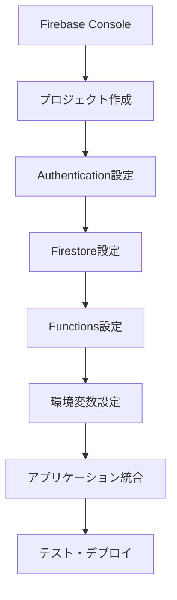

# Firebase認証設定ガイド

## 📖 概要

Contact APIプロジェクトでFirebase Authenticationを使用した管理者認証システムの設定手順を詳しく説明します。このガイドに従って設定することで、安全で使いやすい認証システムを構築できます。

---

## 🎯 設定の全体像



---

## 🚀 Step 1: Firebase プロジェクトの作成

### 1.1 Firebase Console にアクセス
1. [Firebase Console](https://console.firebase.google.com/) にアクセス
2. Googleアカウントでログイン

### 1.2 新しいプロジェクトを作成
1. **「プロジェクトを追加」** をクリック
2. プロジェクト名を入力: `contact-api-prod`
3. **「続行」** をクリック
4. Google Analytics の設定（推奨: 有効化）
5. **「プロジェクトを作成」** をクリック

### 1.3 Webアプリを追加
1. プロジェクト概要で **「</>」** アイコンをクリック
2. アプリのニックネーム: `Contact API Frontend`
3. **「Firebase Hosting を設定」** にチェック
4. **「アプリを登録」** をクリック
5. 設定コードをメモ（後で使用）

---

## 🔐 Step 2: Authentication の設定

### 2.1 Authentication の有効化
1. 左メニューから **「Authentication」** を選択
2. **「使ってみる」** をクリック

### 2.2 ログイン方法の設定

#### Google認証の設定（推奨）
1. **「Sign-in method」** タブを選択
2. **「Google」** を選択
3. **「有効にする」** をオン
4. プロジェクトのサポートメールを設定
5. **「保存」** をクリック

#### メール/パスワード認証の設定
1. **「Email/Password」** を選択
2. **「有効にする」** をオン
3. **「Email link（passwordless sign-in）」** は無効のまま
4. **「保存」** をクリック

### 2.3 承認済みドメインの設定
1. **「Settings」** タブを選択
2. **「承認済みドメイン」** セクション
3. 本番ドメインを追加（例: `contact-api.com`）
4. 開発用として `localhost` が既に追加されていることを確認

---

## 🗄️ Step 3: Firestore Database の設定

### 3.1 Firestore の作成
1. 左メニューから **「Firestore Database」** を選択
2. **「データベースの作成」** をクリック
3. **「本番環境モード」** を選択
4. ロケーションを選択: `asia-northeast1（東京）`
5. **「完了」** をクリック

### 3.2 セキュリティルールの設定
1. **「ルール」** タブを選択
2. 以下のルールを貼り付け：

```javascript
rules_version = '2';
service cloud.firestore {
  match /databases/{database}/documents {
    // 管理者のみアクセス可能
    match /contacts/{contactId} {
      allow read, write: if request.auth != null 
        && request.auth.token.admin == true;
    }
    
    // AI解析結果も管理者限定
    match /contact_ai_analyses/{analysisId} {
      allow read, write: if request.auth != null 
        && request.auth.token.admin == true;
    }
    
    // ベクトルデータも管理者限定
    match /contact_vectors/{vectorId} {
      allow read, write: if request.auth != null 
        && request.auth.token.admin == true;
    }
    
    // 管理者設定（最高管理者のみ）
    match /admin_users/{userId} {
      allow read: if request.auth != null 
        && request.auth.token.admin == true;
      allow write: if request.auth != null 
        && request.auth.token.superAdmin == true;
    }
  }
}
```

3. **「公開」** をクリック

---

## ⚡ Step 4: Cloud Functions の設定（管理者権限用）

### 4.1 Functions の初期化
```bash
# Firebase CLI インストール
npm install -g firebase-tools

# ログイン
firebase login

# プロジェクトを初期化
cd /path/to/contact-api
firebase init functions

# TypeScript を選択
# ESLint を有効化
# 依存関係をインストール
```

### 4.2 管理者権限設定関数の実装
`functions/src/index.ts` を編集：

```typescript
import { initializeApp } from 'firebase-admin/app';
import { getAuth } from 'firebase-admin/auth';
import { onCall } from 'firebase-functions/v2/https';
import { logger } from 'firebase-functions';

initializeApp();

// 管理者権限を付与する関数
export const setAdminClaim = onCall(async (request) => {
  // 既存の管理者のみが新規管理者を作成可能
  if (!request.auth || !request.auth.token.admin) {
    throw new Error('管理者権限が必要です');
  }

  const { uid } = request.data;

  if (!uid) {
    throw new Error('ユーザーIDが必要です');
  }

  try {
    // カスタムクレームを設定
    await getAuth().setCustomUserClaims(uid, {
      admin: true,
      role: 'admin',
      permissions: ['read', 'write', 'admin'],
      grantedBy: request.auth.uid,
      grantedAt: new Date().toISOString()
    });

    logger.info(`Admin claim set for user: ${uid}`);
    
    return { 
      success: true, 
      message: '管理者権限を付与しました',
      uid: uid
    };
  } catch (error) {
    logger.error('Error setting admin claim:', error);
    throw new Error('管理者権限の付与に失敗しました');
  }
});

// 最初の最高管理者を設定する関数（一度だけ実行）
export const setupSuperAdmin = onCall(async (request) => {
  const { email, secretKey } = request.data;

  // セキュリティ: 事前に決めた秘密鍵を要求
  const expectedSecretKey = process.env.SUPER_ADMIN_SECRET_KEY;
  
  if (!expectedSecretKey || secretKey !== expectedSecretKey) {
    throw new Error('無効な認証キーです');
  }

  try {
    // メールアドレスからユーザーを検索
    const user = await getAuth().getUserByEmail(email);
    
    // 最高管理者権限を付与
    await getAuth().setCustomUserClaims(user.uid, {
      admin: true,
      superAdmin: true,
      role: 'super_admin',
      permissions: ['read', 'write', 'admin', 'super_admin'],
      setupAt: new Date().toISOString()
    });

    logger.info(`Super admin setup for user: ${user.uid} (${email})`);
    
    return { 
      success: true, 
      message: '最高管理者を設定しました',
      uid: user.uid
    };
  } catch (error) {
    logger.error('Error setting up super admin:', error);
    throw new Error('最高管理者の設定に失敗しました');
  }
});
```

### 4.3 Functions のデプロイ
```bash
# 環境変数を設定
firebase functions:config:set admin.secret_key="your-super-secret-key"

# Functions をデプロイ
firebase deploy --only functions
```

---

## 🔧 Step 5: アプリケーションの環境設定

### 5.1 環境変数ファイルの作成
`frontend/.env.local` を作成：

```bash
# Firebase 設定（Firebase Console の設定から取得）
NEXT_PUBLIC_FIREBASE_API_KEY=AIzaSyC...
NEXT_PUBLIC_FIREBASE_AUTH_DOMAIN=contact-api-prod.firebaseapp.com
NEXT_PUBLIC_FIREBASE_PROJECT_ID=contact-api-prod
NEXT_PUBLIC_FIREBASE_STORAGE_BUCKET=contact-api-prod.appspot.com
NEXT_PUBLIC_FIREBASE_MESSAGING_SENDER_ID=123456789
NEXT_PUBLIC_FIREBASE_APP_ID=1:123456789:web:abcdef123456

# バックエンドAPI URL
NEXT_PUBLIC_API_URL=http://localhost:8000

# 管理者設定
NEXT_PUBLIC_DEV_ADMIN_EMAILS=admin@example.com,dev@example.com
NEXT_PUBLIC_ADMIN_DOMAIN=your-company.com

# アプリケーション設定
NEXT_PUBLIC_APP_NAME=Contact API
NEXTAUTH_SECRET=your-32-character-secret-here
NEXTAUTH_URL=http://localhost:3000
```

### 5.2 必要パッケージのインストール
```bash
cd frontend
npm install firebase react-icons
```

---

## 🧪 Step 6: テスト・動作確認

### 6.1 認証の動作テスト
1. フロントエンド開発サーバーを起動：
   ```bash
   cd frontend
   npm run dev
   ```

2. ブラウザで `http://localhost:3000/auth/login` にアクセス

3. Google認証でログインを試行

### 6.2 初回管理者の設定
1. まずGoogle認証でログイン（管理者権限なし状態）
2. Firebase Console の Authentication タブでユーザーのUIDを確認
3. Cloud Functions を使用して管理者権限を付与：

```bash
# Firebase CLI で関数を呼び出し
firebase functions:shell

# 関数内で実行
setupSuperAdmin({
  email: 'admin@example.com',
  secretKey: 'your-super-secret-key'
})
```

### 6.3 管理者権限の確認
1. ログアウト後、再度ログイン
2. 管理者ダッシュボード（`/admin`）にアクセス可能か確認
3. ユーザーのトークンに `admin: true` が含まれているか確認

---

## 🚀 Step 7: 本番環境デプロイ

### 7.1 Firebase Hosting の設定
```bash
# Hosting を初期化
firebase init hosting

# ビルドディレクトリ: out （Next.js static export の場合）
# Single-page app: Yes
# GitHub Actions: 任意
```

### 7.2 本番ビルド・デプロイ
```bash
# Next.js のビルド
cd frontend
npm run build

# Firebase にデプロイ
firebase deploy
```

---

## 🔒 セキュリティ確認チェックリスト

### 認証設定
- [ ] Google OAuth が正しく動作する
- [ ] 承認済みドメインに本番ドメインが追加されている
- [ ] 管理者以外がFirestoreにアクセスできない

### 権限管理
- [ ] カスタムクレームで管理者判定が機能する
- [ ] 管理者権限のないユーザーが管理画面にアクセスできない
- [ ] 最高管理者のみが権限付与・削除できる

### データ保護
- [ ] Firestore セキュリティルールが適切に設定されている
- [ ] 機密情報が環境変数で管理されている
- [ ] API キーなどがソースコードに含まれていない

---

## 🆘 トラブルシューティング

### よくある問題と解決方法

#### 1. 「auth/unauthorized-domain」エラー
**原因**: 承認済みドメインに現在のドメインが追加されていない  
**解決方法**: Firebase Console で承認済みドメインに追加

#### 2. 管理者権限が反映されない
**原因**: カスタムクレームの設定後にトークンが更新されていない  
**解決方法**: ログアウト→ログインを行うか、`refreshToken()`を実行

#### 3. Firestore へのアクセスが拒否される
**原因**: セキュリティルールが厳しすぎる、またはカスタムクレームが正しく設定されていない  
**解決方法**: ルールの確認、管理者権限の再設定

#### 4. Cloud Functions が動作しない
**原因**: 環境変数の設定不足、権限設定の問題  
**解決方法**: Firebase Console でログを確認、環境変数を再設定

---

## 📚 関連ドキュメント

- [Firebase Authentication 公式ドキュメント](https://firebase.google.com/docs/auth)
- [Firestore セキュリティルール](https://firebase.google.com/docs/firestore/security/get-started)
- [Firebase Cloud Functions](https://firebase.google.com/docs/functions)
- [Next.js Firebase 統合](https://firebase.google.com/docs/hosting/nextjs)

---

**🎉 これでFirebase認証システムの設定が完了です！安全で使いやすい管理者認証システムをお楽しみください。**